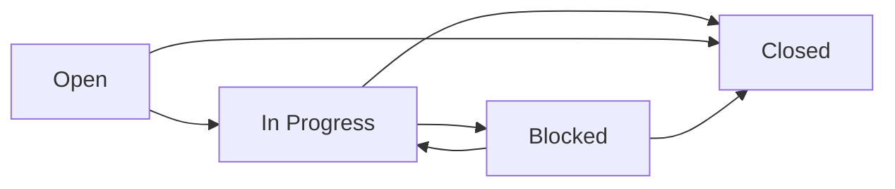

## Overview

Every issue in Tracer has a status that indicates its current state in the workflow. The status determines whether work is ready to start, in progress, blocked, or complete.

## Status Values

Tracer supports four status values:

```rust
pub enum Status {
    Open,       // Ready to work on (default)
    InProgress, // Currently being worked on
    Blocked,    // Temporarily unable to proceed
    Closed,     // Complete
}
```

### Open

The default status for new issues. Indicates work that is ready to be started.

```bash
# Issues are created as 'open' by default
tracer create "Implement feature X"
# Status: open

# Explicitly set status
tracer create "Task" --status open
```

<Info>
  `tracer ready` shows issues with `open` status that have no unresolved blockers.
</Info>

**Characteristics:**
- No assignee required
- Available for any agent to claim
- May have dependencies blocking it from being "ready"

### In Progress

Indicates work that is actively being done.

```bash
# Start working on an issue
tracer update bd-1 --status in_progress
```

<Tip>
  When an issue moves to `in_progress`, Tracer automatically assigns it to the current actor.
</Tip>

**Characteristics:**
- Automatically assigns to current actor (via `--actor` flag or `TRACE_ACTOR` env var)
- Signals to other agents that work is underway
- Can be updated with progress comments

**Example:**

```bash
# Agent starts work
export TRACE_ACTOR="agent-1"
tracer update bd-1 --status in_progress
tracer comment bd-1 "Implementing auth endpoint"

# Later, another agent checks
tracer show bd-1
# Shows: Status: in_progress, Assignee: agent-1
```

### Blocked

Indicates work that cannot proceed due to external factors.

```bash
# Mark issue as blocked
tracer update bd-1 --status blocked
tracer comment bd-1 "Waiting for API design approval"
```

**When to use:**
- Waiting for external dependencies (not tracked in Tracer)
- Blocked by circumstances (missing credentials, unclear requirements)
- Temporary impediments that will be resolved

<Note>
  The `blocked` status is for external blockers. For dependencies between issues, use the `blocks` dependency type instead. See [Dependencies](/concepts/dependencies).
</Note>

**Characteristics:**
- Does not appear in `tracer ready`
- Keeps assignee (work can resume when unblocked)
- Should include comment explaining the blocker

**Unblocking:**

```bash
# When blocker is resolved
tracer update bd-1 --status in_progress
tracer comment bd-1 "Received approval, resuming work"
```

### Closed

Indicates completed work.

```bash
# Close an issue
tracer close bd-1 --reason "Implemented and tested"

# Close multiple issues
tracer close bd-1 bd-2 bd-3 --reason "Sprint complete"
```

**Characteristics:**
- Sets `closed_at` timestamp
- Records closing reason in events
- Unblocks any issues that depend on it
- Excluded from `tracer ready` and active work queries

<Tip>
  Always include a meaningful `--reason` when closing issues. This creates valuable audit trail.
</Tip>

## Status Transitions

Typical workflow progression:



### Common Transitions

<Tabs>
  <Tab title="Open → In Progress">
    Most common transition when starting work.
    
    ```bash
    tracer update bd-1 --status in_progress
    ```
    
    **What happens:**
    - Issue assigned to current actor
    - Status change recorded in events
    - Issue no longer appears in ready work for others
  </Tab>
  
  <Tab title="In Progress → Blocked">
    When work hits an impediment.
    
    ```bash
    tracer update bd-1 --status blocked
    tracer comment bd-1 "Waiting for design clarification"
    ```
    
    **What happens:**
    - Assignee remains (work will resume)
    - Status change recorded
    - Comment captures blocker reason
  </Tab>
  
  <Tab title="Blocked → In Progress">
    When blocker is resolved.
    
    ```bash
    tracer update bd-1 --status in_progress
    tracer comment bd-1 "Design approved, resuming"
    ```
    
    **What happens:**
    - Work resumes with same assignee
    - Status change recorded
  </Tab>
  
  <Tab title="In Progress → Closed">
    Normal completion flow.
    
    ```bash
    tracer close bd-1 --reason "Feature implemented and tested"
    ```
    
    **What happens:**
    - `closed_at` timestamp set
    - Closing reason recorded
    - Dependent issues unblocked
  </Tab>
  
  <Tab title="Open → Closed">
    Closing without doing work (duplicate, won't-fix, etc.).
    
    ```bash
    tracer close bd-1 --reason "Duplicate of bd-5"
    ```
    
    **What happens:**
    - Issue closed without being started
    - Reason explains why it wasn't done
  </Tab>
</Tabs>

## Assignee Behavior

The assignee field tracks who is responsible for an issue:

### Auto-assignment

When status changes to `in_progress`, Tracer automatically assigns the issue:

```bash
# Set actor via environment variable
export TRACE_ACTOR="agent-1"
tracer update bd-1 --status in_progress
# bd-1 is now assigned to agent-1

# Or via flag
tracer --actor "agent-2" update bd-2 --status in_progress
# bd-2 is now assigned to agent-2
```

### Manual assignment

You can explicitly set assignee without changing status:

```bash
tracer update bd-1 --assignee "agent-1"
```

### Clearing assignee

```bash
tracer update bd-1 --assignee ""
```

<Note>
  Assignee is for coordination - it doesn't restrict who can work on an issue. Use it to avoid conflicts in multi-agent scenarios.
</Note>

## Querying by Status

### List Issues by Status

```bash
# All open issues
tracer list --status open

# In-progress work
tracer list --status in_progress

# Blocked issues
tracer list --status blocked

# Closed issues
tracer list --status closed
```

### Ready Work

```bash
# Find work ready to start
tracer ready

# With filters
tracer ready --priority 0
tracer ready --assignee "agent-1"
tracer ready --limit 5
```

From `sqlite.rs:594`, ready work is defined as:
- Status is `open`
- No unresolved `blocks` dependencies

### Blocked Issues

```bash
# See what's blocked and why
tracer blocked

# JSON output
tracer blocked --json
```

Shows:
- Issues with unresolved `blocks` dependencies
- What's blocking each issue
- Count of blockers

## Statistics

The `stats` command breaks down issues by status:

```bash
tracer stats
```

Output includes:

```
Issue Statistics

  Total Issues:      42
  Open:              15
  In Progress:       8
  Blocked:           3
  Closed:            16

  Ready to Work:     12
```

From `sqlite.rs:741`, this counts:
- Total issues across all statuses
- Count per status
- Issues ready to work (open + unblocked)

## Status Events

Every status change creates an event in the audit trail:

```bash
# View event history
tracer show bd-1
```

Events include:
- Who changed the status
- Old and new values
- When it changed
- Associated comments

See `types.rs:206` for `StatusChanged` event type.

## Best Practices

<Accordion title="Always comment when blocking">
  When setting status to `blocked`, add a comment explaining why:
  
  ```bash
  tracer update bd-1 --status blocked
  tracer comment bd-1 "Waiting for access to production database"
  ```
  
  This helps others understand the blocker and potentially resolve it.
</Accordion>

<Accordion title="Use in_progress to claim work">
  In multi-agent environments, move issues to `in_progress` before starting work to signal you're working on it:
  
  ```bash
  export TRACE_ACTOR="agent-1"
  tracer update bd-1 --status in_progress
  tracer comment bd-1 "Starting implementation"
  ```
</Accordion>

<Accordion title="Provide meaningful close reasons">
  The closing reason becomes part of the permanent record:
  
  **Good**: "Feature implemented, tested, and deployed to staging"  
  **Bad**: "Done"
</Accordion>

<Accordion title="Don't confuse blocked status with blocks dependencies">
  - Use `blocked` status for external impediments
  - Use `blocks` dependency type for inter-issue dependencies
  
  See [Dependencies](/concepts/dependencies) for details.
</Accordion>

<Accordion title="Check ready work regularly">
  Run `tracer ready` at the start of each session to find unblocked work:
  
  ```bash
  # Start of session
  tracer ready --limit 5
  # Pick highest priority item and start
  ```
</Accordion>

## Multi-Agent Coordination

Status and assignee work together for coordination:

```bash
# Agent 1: Claim work
export TRACE_ACTOR="agent-1"
tracer update bd-1 --status in_progress
tracer comment bd-1 "Working on auth implementation"

# Agent 2: Check what's available
tracer ready
# bd-1 won't appear (in_progress)

# Agent 2: See what agent-1 is doing
tracer list --status in_progress --assignee "agent-1"

# Agent 1: Finish work
tracer close bd-1 --reason "Auth implemented and tested"

# Agent 2: Now sees unblocked work
tracer ready
# Issues previously blocked by bd-1 now appear
```

See the multi-agent coordination guide for more examples.

## Next Steps

- Learn about [Dependencies](/concepts/dependencies) to understand blocking relationships
- Read [Issues](/concepts/issues) for core issue concepts  
- See [Priorities](/concepts/priorities) for prioritization strategies